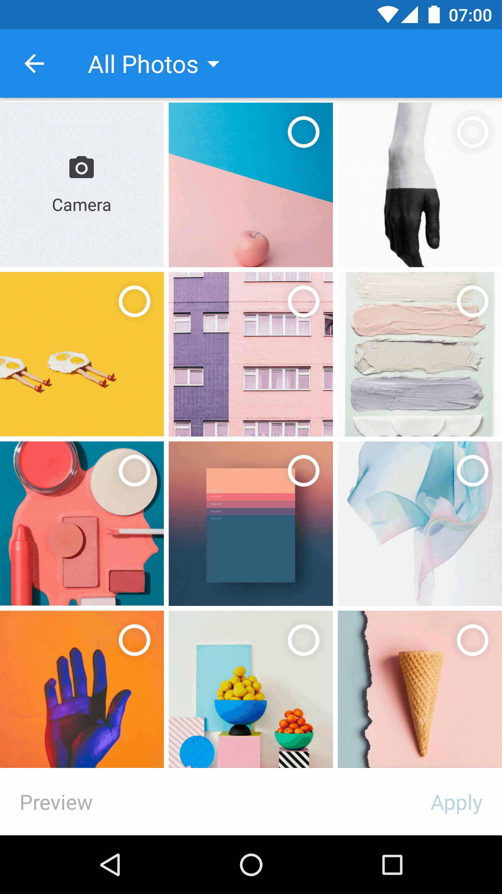
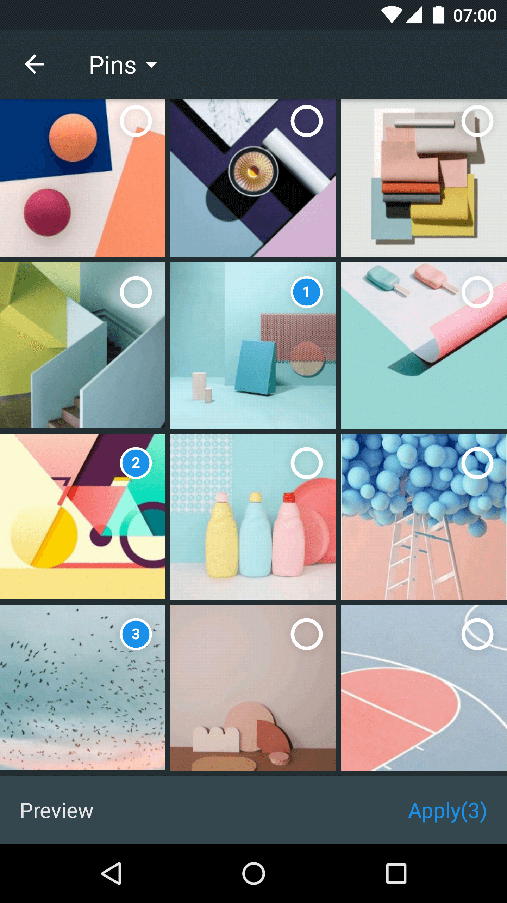
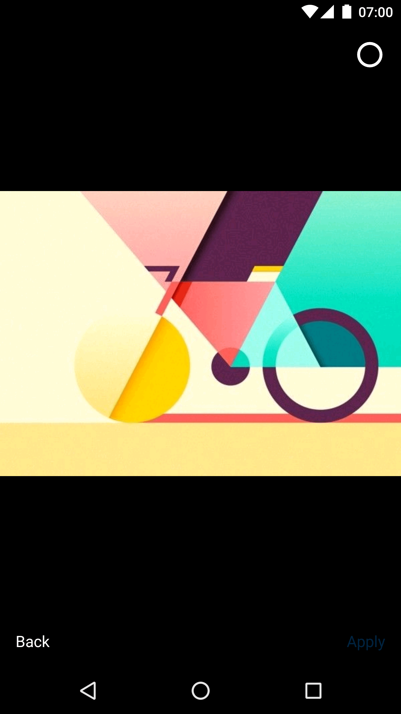

# Matisse
[](https://travis-ci.org/zhihu/Matisse)  
Matisse is a well-designed local image and video selector for Android. You can  
- Use it in Activity or Fragment
- Select images including JPEG, PNG, GIF and videos including MPEG, MP4 
- Apply different themes, including two built-in themes and custom themes
- Different image loaders
- Define custom filter rules
- More to find out yourself

| Zhihu Style                    | Dracula Style                     | Preview                          |
|:------------------------------:|:---------------------------------:|:--------------------------------:|
| |  | |

## Download
Gradle:

```groovy
repositories {
    jcenter()
}

dependencies {
    compile 'com.zhihu.android:matisse:0.4.3'
}
```

Check out [Matisse releases](https://github.com/zhihu/Matisse/releases) to see more unstable versions.

## ProGuard
If you use [Glide](https://github.com/bumptech/glide) as your image engine, add rules as Glide's README says.  
And add extra rule:
```pro
-dontwarn com.squareup.picasso.**
```

If you use [Picasso](https://github.com/square/picasso) as your image engine, add rules as Picasso's README says.  
And add extra rule:
```pro
-dontwarn com.bumptech.glide.**
```
**Attention**: The above progurad rules are correct.

## How do I use Matisse?
#### Permission
The library requires two permissions:
- `android.permission.READ_EXTERNAL_STORAGE`
- `android.permission.WRITE_EXTERNAL_STORAGE`

So if you are targeting Android 6.0+, you need to handle runtime permission request before next step.

#### Simple usage snippet
------
Start `MatisseActivity` from current `Activity` or `Fragment`:

```java
Matisse.from(MainActivity.this)
        .choose(MimeType.allOf())
        .countable(true)
        .maxSelectable(9)
        .addFilter(new GifSizeFilter(320, 320, 5 * Filter.K * Filter.K))
        .gridExpectedSize(getResources().getDimensionPixelSize(R.dimen.grid_expected_size))
        .restrictOrientation(ActivityInfo.SCREEN_ORIENTATION_UNSPECIFIED)
        .thumbnailScale(0.85f)
        .imageEngine(new GlideEngine())
        .forResult(REQUEST_CODE_CHOOSE);
```
 
#### Themes
There are two built-in themes you can use to start `MatisseActivity`:
- `R.style.Matisse_Zhihu` (light mode)
- `R.style.Matisse_Dracula` (dark mode)  

And Also you can define your own theme as you wish.

#### Receive Result
In `onActivityResult()` callback of the starting `Activity` or `Fragment`:

```java
List<Uri> mSelected;

@Override
protected void onActivityResult(int requestCode, int resultCode, Intent data) {
    super.onActivityResult(requestCode, resultCode, data);
    if (requestCode == REQUEST_CODE_CHOOSE && resultCode == RESULT_OK) {
        mSelected = Matisse.obtainResult(data);
        Log.d("Matisse", "mSelected: " + mSelected);
    }
}
```

#### More
Find more details about Matisse in [wiki](https://github.com/zhihu/Matisse/wiki).

## Contributing
[Matisse is an Open Source Project](https://github.com/zhihu/Matisse/blob/master/CONTRIBUTING.md)

## Thanks
This library is inspired by [Laevatein](https://github.com/nohana/Laevatein) and uses some of its source code.

## License

    Copyright 2017 Zhihu Inc.

    Licensed under the Apache License, Version 2.0 (the "License");
    you may not use this file except in compliance with the License.
    You may obtain a copy of the License at

       http://www.apache.org/licenses/LICENSE-2.0

    Unless required by applicable law or agreed to in writing, software
    distributed under the License is distributed on an "AS IS" BASIS,
    WITHOUT WARRANTIES OR CONDITIONS OF ANY KIND, either express or implied.
    See the License for the specific language governing permissions and
    limitations under the License.
